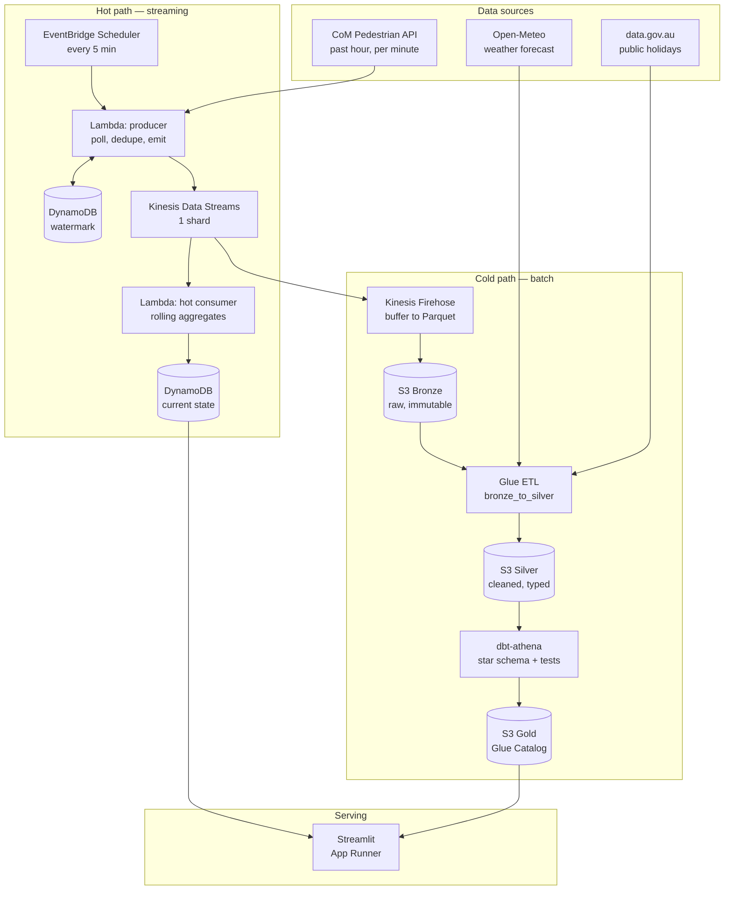
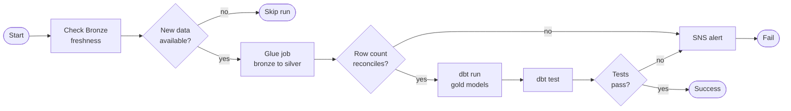

# Melbourne Foot Traffic Intelligence

A production-style streaming data platform on AWS built on live City of Melbourne
pedestrian sensor data, forecasting hourly foot traffic to support CBD retail and
hospitality staffing decisions.


---

## The problem

CBD hospitality and retail venues roster staff a week ahead using intuition.
Foot traffic swings heavily with weather, public holidays, and events.
Overstaffing burns wage cost on quiet days; understaffing loses revenue on busy
ones.

This platform ingests live pedestrian sensor readings, enriches them with weather
and calendar data, and produces a 7-day hourly foot traffic forecast per location
along with a derived staffing recommendation.

---

## A note on "streaming"

The upstream City of Melbourne API publishes on a ~15 minute cadence. It is not a
native event stream.

This project implements a **poll-to-stream adapter**: a scheduled Lambda polls the
API, deduplicates against a high-water mark held in DynamoDB, and emits each new
sensor reading as an individual event onto Kinesis. Everything downstream of
Kinesis is genuinely stream-processed.

This is a standard pattern for integrating batch-published sources into
event-driven platforms, and it is documented here rather than glossed over.

---

## Architecture



### Batch orchestration DAG

The cold path runs as a Step Functions state machine, hourly:



Every task is idempotent — the Silver and Gold writes overwrite their target
partition rather than appending, so any date range can be safely re-run or
backfilled.

---

## Tech stack

| Layer | Service | Why |
|---|---|---|
| Schedule | EventBridge Scheduler | Cron without a server; free |
| Ingest | Lambda (Python 3.12) | Bursty workload, no idle cost |
| Watermark | DynamoDB on-demand | Single-digit ms reads, pay per request |
| Stream | Kinesis Data Streams | On-demand mode has a higher floor at this volume |
| Stream to S3 | Kinesis Firehose | Native Parquet conversion and partitioning |
| Batch transform | Glue ETL (PySpark) | Distributed cleaning at Bronze to Silver |
| Modelling | dbt-athena | SQL transformations with lineage and tests |
| Query | Athena + Glue Catalog | Pay per TB scanned; no idle cluster |
| Orchestration | Step Functions | MWAA costs ~AUD 500/mo and is unjustifiable here |
| Observability | CloudWatch + SNS | Alarms on freshness, failure, and cost |
| Serving | Streamlit on App Runner | Scale to zero |
| IaC | Terraform | Everything as code, no ClickOps |

Architecture decisions and the alternatives rejected are recorded in
[`docs/decisions/`](docs/decisions/).

---

## Data model

Star schema in the Gold layer.

**`fact_footfall_hourly`** — grain: one row per sensor per hour

Foreign keys to `dim_sensor`, `dim_date`, `dim_weather`, `dim_event`.
Measures: `pedestrian_count`, `count_direction_1`, `count_direction_2`,
`reading_completeness_pct`.

**`dim_sensor`** is a **Slowly Changing Dimension Type 2**. City of Melbourne
documents that sensors have been relocated or removed since 2009. A Type 1
overwrite would retroactively attribute historical foot traffic to the wrong
street, so location history is versioned with `valid_from`, `valid_to`, and
`is_current`.

---

## Quickstart

```bash
git clone https://github.com/mowlya-m/melbourne-footfall-platform.git
cd melbourne-footfall-platform

python -m venv .venv && source .venv/bin/activate
pip install -r requirements-dev.txt
pre-commit install

cp .env.example .env          # fill in your AWS account ID and region

cd infra/envs/dev
terraform init
terraform plan
```

---

## Repository layout

```
.
├── .github/workflows/   CI and CD pipelines
├── docs/                design doc, ADRs, runbook, cost analysis
├── infra/               Terraform modules and environments
├── src/                 Lambda functions and Glue jobs
├── transforms/          dbt project
├── dashboard/           Streamlit app
├── tests/               unit, integration, fixtures
└── scripts/             backfill and teardown utilities
```

---

## Cost

Target: under **AUD 30/month**. A billing alarm is provisioned at AUD 15 by
Terraform before any other resource.

Run `scripts/teardown.sh` to destroy the Kinesis shard and App Runner service
while preserving S3 and the Glue Catalog when not actively developing.

Full breakdown in [`docs/cost-analysis.md`](docs/cost-analysis.md).

---

## Data sources and attribution

- Pedestrian counts and sensor locations: **City of Melbourne Open Data**,
  licensed CC BY 4.0
- Weather: **Open-Meteo**
- Public holidays: **data.gov.au**

---

## Verify it works

Invoke the producer and watch a batch land:

```bash
aws lambda invoke --function-name melbourne-footfall-producer-dev \
  --region ap-southeast-2 --cli-binary-format raw-in-base64-out \
  --payload '{}' /tmp/out.json && cat /tmp/out.json
```

Query Bronze through Athena:

```bash
bash scripts/query_bronze.sh
```

That runs a row count, the busiest sensors, a duplicate check on the natural
key, and an ingestion-lag comparison between event time and processing time.

---
## Status

| Component | Status |
|---|---|
| Repository scaffold, CI, CD | Done |
| AWS bootstrap: OIDC, remote state, billing alarm | Done |
| Storage: S3 medallion layout, Glue catalog, Athena workgroup | Done |
| Ingestion: producer Lambda, Kinesis, Firehose to Bronze | Done |
| Bronze catalog table, queryable via Athena | Done |
| Silver: Glue job for cleaning and deduplication | Not started |
| Gold: dbt star schema with SCD Type 2 on sensors | Not started |
| Orchestration: Step Functions | Not started |
| Observability: alarms, freshness checks, runbook | Not started |
| Forecasting model and dashboard | Not started |

The pipeline currently ingests roughly 500 readings per run across 134 sensors,
every five minutes, and lands them in Bronze as partitioned NDJSON.

## Licence

MIT — see [LICENSE](LICENSE).
